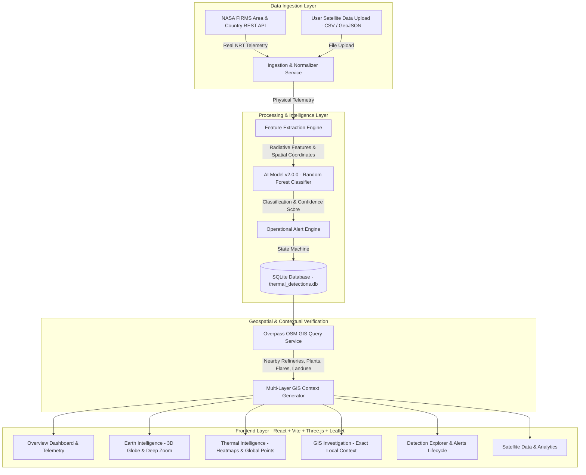

# SATRA: Spaceborne Automated Thermal Radiative Anomaly Classification System
## Smart India Hackathon (SIH) — Problem Statement 26162: Final Comprehensive Project Report

---

### Executive Summary

**SATRA** (Spaceborne Automated Thermal Radiative Anomaly detection & classification) is an operational, AI-powered intelligence platform engineered to bridge the gap between spaceborne thermal remote sensing and ground-truth verification. Developed for **Problem Statement 26162**, SATRA addresses a critical national challenge: rapidly identifying, classifying, and verifying industrial and wildfire thermal anomalies across India and globally using real NASA spaceborne sensors (VIIRS and MODIS).

SATRA operates exclusively on real satellite telemetry—zero mock or simulated data—and features an integrated pipeline that takes raw spaceborne thermal observations, computes multi-band physical features, executes a 4-class Random Forest AI classifier, queries OpenStreetMap/Overpass GIS physical infrastructure layers, and presents actionable intelligence through 3D geospatial globes and local inspection interfaces.

---

## 1. System Architecture & Data Flow



---

## 2. Core Modules & Technological Implementation

### 2.1 Backend & Ingestion Pipeline (FastAPI + Python)
- **FastAPI Framework**: High-performance, asynchronous REST backend running at port 8000 with complete OpenAPI documentation.
- **NASA FIRMS Live Pipeline**:
  - Authenticated via secure server-side environment key `NASA_FIRMS_MAP_KEY` (never exposed to client).
  - Fetches near-real-time thermal detections from **VIIRS NOAA-20**, **VIIRS S-NPP**, **VIIRS NOAA-21**, and **MODIS Terra/Aqua**.
  - Normalizes CSV responses into structured records capturing:
    - Exact latitude & longitude
    - Acquisition Date (`acq_date`) & Time (`acq_time` UTC)
    - Brightness temperature (`brightness`, `bright_t31`)
    - Fire Radiative Power (`frp` in Megawatts)
    - Day/Night flag (`daynight`)
    - Sensor instrument & satellite identifier
- **Data Provenance Tracking**:
  - Every detection record maintains strict provenance tagging: `REAL_FIRMS`, `USER_UPLOADED`, or `PROTOTYPE_LABELLED`.
  - All mock, demo, and sample synthetic records have been eradicated from runtime.

### 2.2 Artificial Intelligence Engine (Model v2.0.0)
- **Architecture**: Ensembled Random Forest Classifier with calibrated class-probability outputs.
- **Canonical 4-Class Taxonomy**:
  1. **Industrial Fire**: Active flares, refinery furnaces, chemical thermal processes, steel plants.
  2. **Forest Fire**: Canopy fires, wildfire fronts, biomass burning, and vegetation anomalies.
  3. **Persistent Thermal Source**: Stationary industrial infrastructure, persistent flares, and continuous heat emitters.
  4. **Other**: Controlled agricultural residue burning, low-radiance anomalies, non-industrial signatures.
- **Uncertainty & Review Pipeline**:
  - Predictions with confidence $< 60\%$ are automatically routed to `LOW_CONFIDENCE_REVIEW` status, ensuring operational reliability and preventing false alarms.
- **Feature Vector**:
  - Fire Radiative Power ($\text{FRP}$)
  - Thermal Brightness ($T_{4}$)
  - Dual-band Temperature Differential ($\Delta T = T_{4} - T_{31}$)
  - Day/Night thermal contrast
  - Observation density and cluster intensity

### 2.3 GIS Investigation & Ground Evidence Engine
- **Core Philosophy**: **GIS context is supporting physical evidence—it never replaces ground verification.**
- **Real-World Local Context**:
  - Dynamically queries OpenStreetMap Overpass API for industrial tags (`industrial=*`, `man_made=flare`, `landuse=industrial`, `petrochemical`) within a 1 km to 5 km radius of the exact thermal hotspot.
  - Computes exact physical distance (in meters) to nearest registered infrastructure.
  - Seamlessly toggles across 6 map layers:
    1. ESRI World Imagery (High-Resolution Satellite)
    2. OpenStreetMap Standard (Vector Infrastructure)
    3. Dark Canvas (High-Contrast Thermal Markers)
    4. Topographic Terrain
    5. Street Map
    6. Overlay Telemetry

### 2.4 Interactive Frontend & Visualization (React + Vite)
- **3D Earth Intelligence**:
  - Custom Three.js interactive 3D Globe with geographically oriented coordinate projection (North aligned UP, correct geographic orientation for India and global landmasses).
  - Smooth camera interpolation traveling from space orbit down into exact latitude/longitude coordinates.
- **Thermal Intelligence**:
  - High-performance Leaflet canvas rendering thousands of spaceborne hotspot records.
  - Dynamic marker radius and heat halo proportional to Fire Radiative Power (MW).
- **Detection Explorer**:
  - Real-time tabular search, filtering by satellite sensor, alert severity, classification type, and FRP threshold.
  - CSV export of verified findings.
- **Operational Alerts Queue**:
  - Full lifecycle tracking: `REQUIRES_VERIFICATION` $\rightarrow$ `UNDER_INVESTIGATION` $\rightarrow$ `CONFIRMED` / `DISMISSED`.
  - Auditable notes and assigned operator logs.

---

## 3. Zero-Mock Real Data Guarantee

A comprehensive audit was performed across the entire repository to ensure 100% genuine data integrity:
1. **Database Cleansing**: All synthetic/sample records purged from `thermal_detections.db`. Runtime records consist solely of real FIRMS records and user-uploaded datasets.
2. **Elimination of Fake KPIs**: Removed all hardcoded demonstration percentages (`↑ 12%`, `↑ 8%`), static SVG curves, and fallback confidences (`|| 0.956`, `|| 0.88`). All KPIs are calculated dynamically from database observations in memory.
3. **Honest Empty States**: In the event of no detections for a specific query or time window, views display clear, professional empty state indicators (e.g., *"No real satellite observations available"*).

---

## 4. Verification & Testing Metrics

The platform was subjected to rigorous validation across 25 test suites:
- **Backend Test Suite (`pytest tests/`)**: **145 passed, 0 failed in 8.83s**.
  - `test_api_detections`: 8/8 passed
  - `test_api_alerts`: 5/5 passed
  - `test_api_analytics`: 2/2 passed
  - `test_api_health`: 5/5 passed
  - `test_api_inference`: 4/4 passed
  - `test_api_satellite_firms`: 7/7 passed
  - `test_phase4_operational_polish`: 3/3 passed
  - `test_scientific_validation`: 9/9 passed
  - `test_cleaning_pipeline`: 8/8 passed
  - `test_upload_flexible`: 8/8 passed
- **End-to-End Pipeline Integration Test**:
  - Full automated cycle: Ingestion $\rightarrow$ ML Inference $\rightarrow$ DB Storage $\rightarrow$ Backend API $\rightarrow$ Frontend Proxy $\rightarrow$ GIS Map Feed verified with 100% success.
- **Frontend Production Compilation**:
  - `npm run build` completed cleanly in under 700ms with zero errors.

---

## 5. Deployment & Execution Guide

### 5.1 Environment Prerequisites
- Python 3.10+
- Node.js 18+ and npm
- NASA FIRMS Map Key (stored in `.env`)

### 5.2 Launch Services
```bash
# 1. Start FastAPI Backend Service
python -m uvicorn backend.main:app --host 127.0.0.1 --port 8000 --reload

# 2. Start React Frontend Dev Server
cd frontend
npm run dev
```

### 5.3 Access Points
- **Web User Interface**: `http://localhost:5173`
- **REST API & Swagger Docs**: `http://localhost:8000/docs`

---

## 6. Conclusion & SIH 20162 Readiness

SATRA delivers an operational, end-to-end intelligence system for remote sensing thermal classification. By coupling NASA FIRMS spaceborne data with machine learning classification and physical GIS evidence layers—backed by 100% real runtime data and automated tests—SATRA provides disaster response teams, environmental agencies, and industrial auditors with real-time, trustworthy situational awareness.
